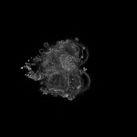
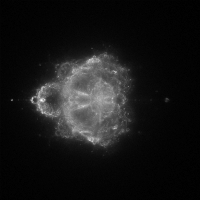
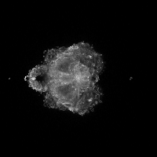

CUDAbrot: A "Buddhabrot" Renderer using CUDA or HIP
===================================================

About
-----

This project contains a small CUDA program for rendering the Buddhabrot fractal
using a CUDA-capable GPU.

I'm aware that there are at least two other github projects named "cudabrot",
but both of them render the Mandelbrot set rather than the Buddhabrot. The
Buddhabrot set is a variant of the Mandelbrot set similar to an
[attractor](https://en.wikipedia.org/wiki/Attractor), and is generally more
processor-intensive to render. Therefore, rendering high-resolution Buddhabrot
images is an excellent application of GPU computing.

For more information on how the Buddhabrot set is rendered, see the
[Wikipedia article](https://en.wikipedia.org/wiki/Buddhabrot) for information
about the algorithm and the relationship to the Mandelbrot set.

Usage
-----

To compile and run this program, you need to be using a Linux system with CUDA
installed (the more recent the version, the better), and a CUDA-capable GPU.
See below for instructions on AMD, using HIP.

Compile the program simply by running `make`. Run it by running `./cudabrot`.
A summary of command-line arguments can be obtained by running
`./cudabrot --help`. Running the program will produce a single grayscale image.
Typically, a colored Buddhabrot image is created by rendering several single-
channel images with different parameters, then combining the results by
assigning each single-channel image to a color in the output image.

Compilation on AMD, using ROCm
------------------------------

This program has also been built and tested using ROCm 3.7 (but older versions
probably work) on AMD GPUs. To use this, you'll need to have
[installed ROCm](https://github.com/RadeonOpenCompute/ROCm), including `hip`,
`rocRAND`, and `hipRAND` (these should be installed by default if you just
follow the main ROCm installation instructions). Additionally, you'll need to
ensure that `hipcc` and `hipify-perl` are on your `PATH`. The makefile also
expects to be able to find `rocRAND` and `hipRAND` under `/opt/rocm/rocrand`
and `/opt/rocm/hiprand`, respectively.

If you satisfy all of the above requirements, then you should be able to
compile the program by running `make hip`. This will produce a `cudabrot`
binary that behaves the same way as the CUDA version. (Don't be intimidated by
these instructions--check the makefile, it's actually very simple!)


Examples and detailed description of options
--------------------------------------------

All examples below were rendered using an NVIDIA GTX 970 with 4GB of GPU RAM.

 - `-d <device number>`: Example: `./cudabrot -d 0`. If you have more than one
   GPU, providing the `-d` flag along with a device number allows you to run
   computations on a GPU of your choosing. If the `-d` flag isn't specified,
   the program defaults to using GPU 0.

 - `-o <output file name>`: Example: `./cudabrot -o image.pgm`. This program is
   capable only of saving `.pgm`-format images, which are a simple grayscale
   bitmap format. Output images always use 16-bit grayscale. If left
   unspecified, the program will save the image to a file named `output.pgm` by
   default.

 - `-w <image width>`: Example: `./cudabrot -w 500 -h 500`. This flag controls
   the horizontal resolution of the output image, in pixels. Note that neither
   this nor `-h` (for controlling vertical resolution) affects resolution at
   which the complex plane is actually sampled. Image resolution doesn't
   directly affect computation speed, but it *will* have an impact on GPU and
   CPU memory required. For example, rendering a 20000x20000 image
   (`-w 20000 -h 20000`) takes at least 3 GB of GPU memory, so higher
   resolutions may only be possible on more-capable GPUs.

 - `-h <image height>`: Example: `./cudabrot -w 500 -h 500`. This is like `-w`,
   except it controls vertical resolution rather than horizontal resolution.

 - `--min-real <minimum real value>`: Example: `./cudabrot -w 500 -h 250 --min-real 0.0 --max-real 1.0 --min-imag 0.0 --max-imag 0.5`.
   This, along with `--max-real`, `--min-imag`, and `--max-imag` control the
   borders of the output-image "canvas" on the complex plane. The rectangle
   specified must be well-formed (e.g. `--min-real` must be less than
   `--max-real`, etc.). If you want to set the canvas to something that isn't a
   square, then you'll also need manually adjust the output width and height to
   match the aspect ratio. For example, the above example results in this
   image: . Note that "zooming
   in" will *not* necessarily speed up rendering, since points must still be
   sampled from across the entire Mandelbrot-set domain (from -2.0 to 2.0, and
   -2.0i to 2.0i).  However, these settings can still be used for saving memory
   if you want to zoom in on finer details without rendering an
   ultra-high-resolution image. `--min-real` defaults to -2.0.

 - `--max-real <maximum real value>`. See the note about `--min-real`.
   `--max-real` defaults to 2.0.

 - `--min-imag <minimum imaginary value>`. See the note about `--min-real`.
   `--min-imag` defaults to -2.0.

 - `--max-imag <maximum imaginary value>`. See the note about `--min-real`.
   `--max-imag` defaults to 2.0.

 - `-t <time to run (in seconds)>`: Example: `./cudabrot -t 60`. This option
   specifies the amount of time, in seconds, to run the rendering on the GPU.
   The longer the time, the sharper the image will appear (especially at high
   resolutions or number of iterations). Passing a special value of -1 to `-t`
   will cause the program to run until it is interrupted by the user (using
   `kill` or CTRL+C on Linux, for example). Example: `./cudabrot -t -1`. If the
   program is run with `-t -1` and killed by the user, it will save the
   currently-rendered output image. This is the recommended way to run the
   program, if, for example, you want to render an image overnight. This option
   defaults to 10 seconds.

 - `-g <gamma correction>`: Example: `./cudabrot -g 2.0`. This option specifies
   the amount of gamma correction to be applied post-rendering. Gamma
   correction brightens darker areas of the image, which enhances the
   visibility of some details. In most cases, it may be easier to apply gamma
   correction post-rendering using a separate image editor (where changes can
   be previewed), but this option is available for convenience and scripting.
   This option defaults to 1.0 (no gamma correction).
   Example images:

    | `./cudabrot -r 200 -m 10000 -c 8000 -t 30 -g 1.0` | `./cudabrot -r 200 -m 10000 -c 8000 -t 30 -g 1.5` | `./cudabrot -r 200 -m 10000 -c 8000 -t 30 -g 2.2` |
    | :---: | :---: | :---: |
    |  |  |  |

 - `-m <max escape iterations>`: Example: `./cudabrot -m 10000`. This option
   specifies the maximum iterations to follow each particle before determining
   whether it remains in the Mandelbrot set (meaning that its path is included
   in the Buddhabrot set). In short, increasing this value will include more
   fine details in the resulting image. This value defaults to 100, which is a
   fairly low value. See these examples:

    | `./cudabrot -r 200 -t 10 -c 20 -m 100` | `./cudabrot -r 200 -t 10 -c 20 -m 1000` | `./cudabrot -r 200 -t 10 -c 20 -m 20000` |
    | :---: | :---: | :---: |
    |  |  |  |

 - `-c <min escape iterations>`: Example: `./cudabrot -m 5000 -c 4000`. This
   option specifies the minimum cutoff for the number of iterations for which
   points must *remain* in the Mandelbrot set if they are to be included in
   the Buddhabrot. Increasing the minimum cutoff iterations will therefore
   reduce the "cloudiness" of the generated image, enhancing the visibility of
   the details produced using higher `-m` values. This value defaults to 20,
   which will produce a cloudy, nebulous image. See these examples:

    | `./cudabrot -r 200 -t 30 -g 1.8 -m 20000 -c 20` | `./cudabrot -r 200 -t 30 -g 1.8 -m 20000 -c 2000` | `./cudabrot -r 200 -t 30 -g 1.8 -m 20000 -c 10000` |
    | :---: | :---: | :---: |
    |  |  |  |

Coloring the Buddhabrot
-----------------------

The Buddhabrot rendering maps most easily to grayscale images, so coloring is
left to post-processing. The "traditional" way to color a Buddhabrot is to
generate several grayscale images using different minimum and maximum iteration
values (the `-r` and `-c` options in this program). The grayscale images can
then be combined into a single output image, with each grayscale image
contributing to a different color channel in the output.

A free program that can be used to combine grayscale images into a single color
image exists [in a separate repository](https://github.com/yalue/image_combiner).

Here's an example of how to create a color image, using the `image_combiner`
tool linked above:

```bash
./cudabrot -g 2.0 -r 1000 -m 100 -c 20 -t 20 -o low_iterations.pgm
./cudabrot -g 2.0 -r 1000 -m 2000 -c 600 -t 20 -o mid_iterations.pgm
./cudabrot -g 2.5 -r 1000 -m 10000 -c 9000 -t 40 -o high_iterations.pgm
./image_combiner \
    low_iterations.pgm blue \
    mid_iterations.pgm lime \
    high_iterations.pgm red \
    color_output.jpg
```

The above commands result in this colored image:

