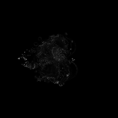
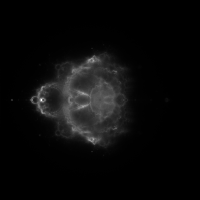

CUDAbrot: A "Buddhabrot" Renderer using CUDA
============================================

About
-----

First off: I'm aware that there are at least two other github projects named
"cudabrot", but both of them render the Mandelbrot set rather than the
Buddhabrot, which is a (more processing-intensive) variation and, therefore, an
excellent use case for CUDA (see further down in the description for some
examples). Additionally, neither of the other projects appeared to be recently-
updated or well-documented.

For information on how the Buddhabrot set is rendered, see the
[Wikipedia article](https://en.wikipedia.org/wiki/Buddhabrot) for information
about the algorithm and the relationship to the Mandelbrot set.

Usage
-----

To compile and run this program, you need to be using a Linux system with CUDA
installed (the more recent the version, the better), and a CUDA-capable GPU.

Compile the program simply by running `make`. Run it by running `./cudabrot`.
A summary of command-line arguments can be obtained by running
`./cudabrot --help`. Running the program will produce a single grayscale image.
Typically, a colored buddhabrot image is created by rendering several single-
channel images with different parameters, then combining the results by
assigning each single-channel image to a color in the output image.

Examples and detailed description of options
--------------------------------------------

All examples below were rendered using an NVIDIA GTX 970 with 4GB of memory.

 - `-d <device number>`: Example: `./cudabrot -d 0`. If you have more than one
   GPU, providing the `-d` flag along with a device number allows you to run
   computations on a GPU of your choosing. If the `-d` flag isn't specified,
   the program defaults to using GPU 0.

 - `-o <output file name>`: Example: `./cudabrot -o image.pgm`. This program is
   capable only of saving `.pgm`-format images, which are a simple grayscale
   bitmap format. Output images always use 16-bit grayscale. If left
   unspecified, the program will save the image to a file named `output.pgm` by
   default.

 - `-r <resolution>`: Example: `./cudabrot -r 10000`. The `-r` flag controls
   the resolution of the output image. Since the Buddhabrot is always drawn on
   a square canvas, this option specifies the number of pixels along a single
   side of the square. Increasing the resolution won't slow down the program,
   but it *will* increase the amount of GPU and CPU memory required. For
   example, rendering a 20000x20000 image (`-r 20000`) takes at least 3 GB of
   GPU memory, so higher resolutions may only be possible with more-capable
   GPUs.

 - `-t <time to run (in seconds)>`: Example: `./cudabrot -t 60`. This option
   specifies the amount of time, in seconds, to run the rendering on the GPU.
   The longer the time, the sharper the image will appear (especially at high
   resolutions or number of iterations). Passing a special value of -1 to `-t`
   will cause the program to run until it is interrupted by the user (using
   `kill` or CTRL+C on Linux, for example). Example: `./cudabrot -t -1`. If the
   program is run with `-t -1` and killed by the user, it will save the
   currently-rendered output image. This is the recommended way to run the
   program, if, for example, you want to render an image overnight. This option
   defaults to 10 seconds.

 - `-g <gamma correction>`: Example: `./cudabrot -g 2.0`. This option specifies
   the amount of gamma correction to be applied post-rendering. Gamma
   correction brightens darker areas of the image, which enhances the
   visibility of some details. In most cases, it may be easier to apply gamma
   correction post-rendering using a separate image editor (where changes can
   be previewed), but this option is available for convenience and scripting.
   This option defaults to 1.0 (no gamma correction).
   Example images:

    - `./cudabrot -r 200 -m 1000 -c 100 -t 10 -g 1.0`: 
      

    - `./cudabrot -r 200 -m 1000 -c 100 -t 10 -g 1.5`: 
      

    - `./cudabrot -r 200 -m 1000 -c 100 -t 10 -g 2.2`: 
      

 - `-m <max escape iterations>`: Example: `./cudabrot -m 10000`. This option
   specifies the maximum iterations to follow each particle before determining
   whether it remains in the Mandelbrot set (meaning that its path is included
   in the buddhabrot set). In short, increasing this value will produce more
   "fine" details in the resulting image. This value defaults to 100, which is
   a fairly low value. See these examples:

    - `./cudabrot -r 200 -t 10 -c 20 -m 100`: 
      

    - `./cudabrot -r 200 -t 10 -c 20 -m 1000`: 
      

    - `./cudabrot -r 200 -t 10 -c 20 -m 20000`: 
      
